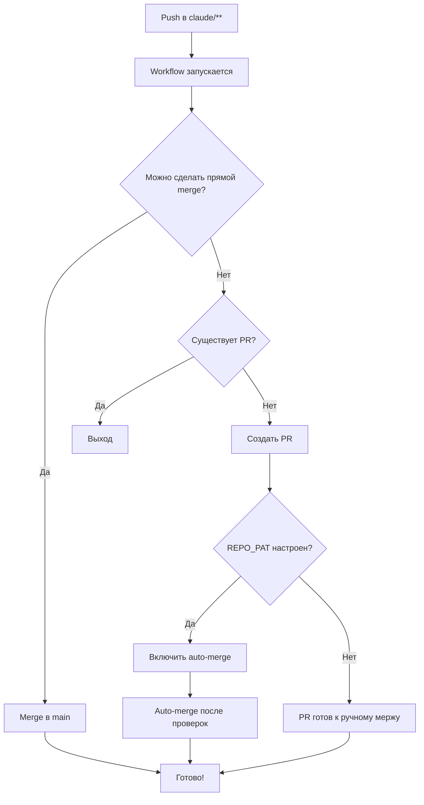

# GitHub Actions Auto-Merge Workflow Setup

## 📋 Обзор

Этот workflow автоматически обрабатывает все ветки с префиксом `claude/**`:
- Пытается выполнить прямой merge в `main`
- Если не получается - создает Pull Request
- Опционально включает auto-merge (требуется PAT)

## 🚀 Быстрый старт

Workflow уже активен! После пуша в любую ветку `claude/**` он автоматически запустится.

### Проверить статус workflow:
```
https://github.com/alexPOPRAVITEL/ZubSt12/actions
```

### Проверить созданные PR:
```
https://github.com/alexPOPRAVITEL/ZubSt12/pulls
```

## ⚙️ Настройка Personal Access Token (PAT)

PAT необходим для включения auto-merge. Без него workflow будет только создавать PR.

### Шаг 1: Создать токен

1. Перейдите в GitHub → **Settings** (ваш профиль)
2. **Developer settings** → **Personal access tokens** → **Tokens (classic)**
3. Нажмите **Generate new token (classic)**
4. Настройте токен:
   - **Note**: `ZubSt12 Auto-Merge Workflow`
   - **Expiration**: Рекомендуется `No expiration` или `1 year`
   - **Scopes**: Выберите `repo` (full control of private repositories)
     - ✅ `repo:status`
     - ✅ `repo_deployment`
     - ✅ `public_repo`
     - ✅ `repo:invite`
     - ✅ `security_events`
5. Нажмите **Generate token**
6. **ВАЖНО**: Скопируйте токен сразу (он показывается только один раз!)

### Шаг 2: Добавить секрет в репозиторий

1. Перейдите в репозиторий: https://github.com/alexPOPRAVITEL/ZubSt12
2. **Settings** → **Secrets and variables** → **Actions**
3. Нажмите **New repository secret**
4. Заполните:
   - **Name**: `REPO_PAT`
   - **Secret**: Вставьте скопированный токен
5. Нажмите **Add secret**

### Шаг 3: Проверить работу

После настройки PAT:
1. Сделайте любое изменение в ветке `claude/**`
2. Запушьте изменения
3. Workflow автоматически:
   - Попробует merge в main
   - Если не получится - создаст PR
   - **Включит auto-merge** на PR (новая возможность!)

## 🔒 Безопасность

### Рекомендации:

1. **Branch Protection** - настройте защиту для `main`:
   ```
   Settings → Branches → Branch protection rules → main
   ```
   - ✅ Require a pull request before merging
   - ✅ Require approvals (минимум 1)
   - ✅ Require status checks to pass before merging
   - ✅ Require conversation resolution before merging
   - ✅ Do not allow bypassing the above settings

2. **Required Checks** - добавьте обязательные проверки:
   - Tests (если есть)
   - Build
   - Linting
   - Type checking

3. **Ограничения токена**:
   - Используйте токен ТОЛЬКО с `repo` scope
   - Не давайте дополнительные права
   - Регулярно обновляйте токен (раз в год)

## 📊 Как это работает



## 🎯 Сценарии использования

### Сценарий 1: Прямой merge
- **Условие**: Нет конфликтов, нет защиты ветки
- **Результат**: Автоматический merge в main
- **Время**: ~30 секунд

### Сценарий 2: PR с auto-merge
- **Условие**: Есть защита ветки, настроен REPO_PAT
- **Результат**: PR создан и настроен auto-merge
- **Время**: После прохождения всех проверок (авто)

### Сценарий 3: PR без auto-merge
- **Условие**: Нет REPO_PAT
- **Результат**: PR создан, требуется ручной merge
- **Время**: Зависит от вас

### Сценарий 4: Конфликты
- **Условие**: Есть конфликты с main
- **Результат**: PR создан с пометкой о конфликтах
- **Действие**: Необходимо разрешить конфликты вручную

## 🔍 Мониторинг

### Проверить последний запуск:
```bash
# В терминале (если установлен gh CLI):
gh run list --workflow="auto-merge-claude.yml"
gh run view <run-id>
```

### Через веб-интерфейс:
1. https://github.com/alexPOPRAVITEL/ZubSt12/actions
2. Выберите workflow "Auto-merge Claude branches to main"
3. Посмотрите логи

## 🐛 Troubleshooting

### Workflow не запускается
- ✅ Проверьте, что ветка начинается с `claude/`
- ✅ Проверьте, что файл `.github/workflows/auto-merge-claude.yml` в main
- ✅ Проверьте права доступа в Settings → Actions → General

### PR не создается
- ✅ Проверьте права `pull-requests: write` в workflow
- ✅ Проверьте логи workflow в Actions
- ✅ Убедитесь, что PR не существует уже

### Auto-merge не включается
- ✅ Проверьте, что REPO_PAT настроен
- ✅ Проверьте, что токен имеет `repo` scope
- ✅ Убедитесь, что auto-merge включен в настройках репо
- ✅ Проверьте branch protection rules

### Merge не проходит
- ✅ Проверьте наличие конфликтов
- ✅ Проверьте branch protection rules
- ✅ Проверьте required status checks

## 📚 Дополнительные ресурсы

- [GitHub Actions Documentation](https://docs.github.com/en/actions)
- [GitHub REST API - Merges](https://docs.github.com/en/rest/branches/branches#merge-a-branch)
- [GitHub REST API - Pull Requests](https://docs.github.com/en/rest/pulls)
- [Managing auto-merge](https://docs.github.com/en/pull-requests/collaborating-with-pull-requests/incorporating-changes-from-a-pull-request/automatically-merging-a-pull-request)

## 🎉 Готово!

Теперь все ваши изменения в ветках `claude/**` будут автоматически обрабатываться!

Следующий пуш в любую ветку `claude/**` активирует workflow.
